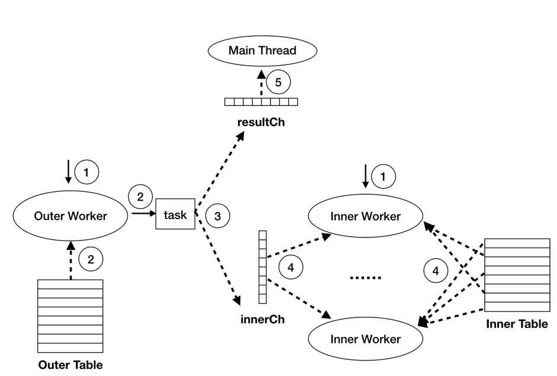
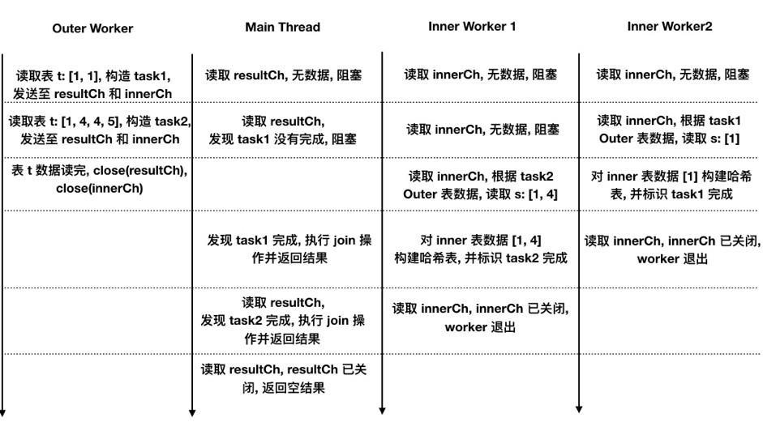

## 什么是 Index Lookup Join

### Nested Loop Join

在介绍 Index Lookup Join 之前，我们首先看一下什么是 **Nested Loop Join（NLJ）**。 NLJ 的具体定义可以参考 [Wikipedia](https://en.wikipedia.org/wiki/Nested_loop_join)。NLJ 是最为简单暴力的 Join 算法，其执行过程简述如下：  

*   遍历 Outer 表，取一条数据 r；

*   遍历 Inner 表，对于 Inner 表中的每条数据，与 r 进行 join 操作并输出 join 结果；

*   重复步骤 1，2 直至遍历完 Outer 表中的所有数据。

NLJ 算法实现非常简单并且 join 结果的顺序与 Outer 表的数据顺序一致。

但是存在性能上的问题：执行过程中，对于每一条 OuterRow，我们都需要对 Inner 表进行一次**全表扫**操作，这将消耗大量时间。

为了减少对于 Inner 表的全表扫次数，我们可以将上述步骤 1 优化为每次从 Outer 表中读取一个 batch 的数据，优化后的算法即 **Block Nested-Loop Join（BNJ）**，BNJ 的具体定义可以参考 [Wikipedia](https://en.wikipedia.org/wiki/Block_nested_loop)。

### Index Lookup Join

对于 BNJ 算法，我们注意到，对于 Outer 表中每个 batch，我们并没有必要对 Inner 表都进行一次全表扫操作，很多时候可以通过索引减少数据读取的代价。**Index Lookup Join（ILJ）** 在 BNJ 基础上进行了改进，其执行过程简述如下：

*   从 Outer 表中取一批数据，设为 B；

*   通过 Join Key 以及 B 中的数据构造 Inner 表取值范围，只读取对应取值范围的数据，设为 S；

*   对 B 中的每一行数据，与 S 中的每一条数据执行 Join 操作并输出结果；

*   重复步骤 1，2，3，直至遍历完 Outer 表中的所有数据。


## TiDB Index Lookup Join 的实现

TiDB 的 ILJ 算子是一个多线程的实现，主要的线程有： Main Thead，Outer Worker，和 Inner Worker：

*   **Outer Worker 一个：**
   * 按 batch 遍历 Outer 表，并封装对应的 task
   * 将 task 发送给 Inner Worker 和 Main Thread

*   **Inner Worker N 个：**
    * 读取 Outer Worker 构建的 task
    * 根据 task 中的 Outer 表数据，构建 Inner 表的扫描范围，并构造相应的物理执行算子读取该范围内的 Inner 表数据
    * 对读取的 Inner 表数据创建对应的哈希表并存入 task

*   **Main Thread 一个：**

    * 启动 Outer Worker 及 Inner Workers
    * 读取 Outer Worker 构建的 task，并对每行 Outer 数据在对应的哈希表中 probe
    * 对 probe 到的数据进行 join 并返回执行结果

这个算子有如下特点：

*   Join 结果的顺序与 Outer 表的数据顺序一致，这样对上一层算子可以提供顺序保证；

*   对于 Outer 表中的每个 batch，只在 Inner 表中扫描部分数据，提升单个 batch 的处理效率；

*   Outer 表的读数据操作，Inner 表的读数据操作，及 Join 操作并行执行，整体上是一个并行+Pipeline 的方式，尽可能提升执行效率。

### 执行阶段详述

TiDB 中 ILJ 的执行阶段可划分为如下图所示的 5 步：



**1\. 启动 Outer Worker 及 Inner Workers**

这部分工作由 [startWorkers](https://github.com/pingcap/tidb/blob/source-code/executor/index_lookup_join.go#L130) 函数完成。该函数会 [启动一个 Outer Worker](https://github.com/pingcap/tidb/blob/source-code/executor/index_lookup_join.go#L138) 和 [多个 Inner Worker](https://github.com/pingcap/tidb/blob/source-code/executor/index_lookup_join.go#L141)。Inner Woker 的数量可以通过 `tidb_index_lookup_concurrency` 这个系统变量进行设置，默认为 4。

**2\. 读取 Outer 表数据**

这部分工作由 [buildTask](https://github.com/pingcap/tidb/blob/source-code/executor/index_lookup_join.go#L314) 函数完成。此处主要注意两点：

第一点，对于每次读取的 batch 大小，如果将其设置为固定值，则可能会出现如下问题：

*   若设置的 batch 值**较大**，但 Outer 表数据量**较小**时。各个 Inner Worker 所需处理的任务量可能会不均匀，出现数据倾斜的情况，导致并发整体性能相对单线程提升有限。

*   若设置的 batch 值**较小**，但 Outer 表数据量**较大**时。Inner Worker 处理任务时间短，需要频繁从管道中取任务，CPU 不能被持续高效利用，由此带来大量的线程切换开销。此外, 当 batch 值较小时，同一批 inner 表数据能会被反复读取多次，带来更大的网络开销，对整体性能产生极大影响。

因此，我们通过指数递增的方式动态控制 batch 的大小（由函数 [increaseBatchSize](https://github.com/pingcap/tidb/blob/source-code/executor/index_lookup_join.go#L348) 完成），以避免上述问题，batch size 的最大值由 session 变量 `tidb_index_join_batch_size` 控制，默认是 25000。读取到的 batch 存储在 [lookUpJoinTask.outerResult](https://github.com/pingcap/tidb/blob/source-code/expression/chunk_executor.go#L225) 中。

第二点，如果 Outer 表的过滤条件不为空，我们需要对 outerResult 中的数据进行过滤（由函数 [VectorizedFilter](https://github.com/pingcap/tidb/blob/source-code/expression/chunk_executor.go#L225) 完成）。outerResult 是 Chunk 类型（[Chunk 的介绍请参考 TiDB 源码阅读系列文章（十）](https://pingcap.com/blog-cn/tidb-source-code-reading-10/)），如果对满足过滤条件的行进行提取并重新构建对象进行存储，会带来不必要的时间和内存开销。`VectorizedFilter` 函数通过一个长度与 outerResult 实际数据行数相等的 bool slice 记录 outerResult 中的每一行是否满足过滤条件以避免上述开销。 该 bool slice 存储在 [lookUpJoinTask.outerMatch](https://github.com/pingcap/tidb/blob/source-code/executor/index_lookup_join.go#L81) 中。

**3\. Outer Worker 将 task 发送给 Inner Worker 和 Main Thread**

Inner Worker 需要根据 Outer 表每个 batch 的数据，构建 Inner 表的数据扫描范围并读取数据，因此 Outer Worker 需要将 task [发送给 Inner Worker](https://github.com/pingcap/tidb/blob/source-code/executor/index_lookup_join.go#L304)。

如前文所述，ILJ 多线程并发执行，且 Join 结果的顺序与 Outer 表的数据顺序一致。 为了实现这一点，Outer Worker 通过管道将 task [发送给 Main Thread](https://github.com/pingcap/tidb/blob/source-code/executor/index_lookup_join.go#L299)，Main Thread 从管道中按序读取 task 并执行 Join 操作，这样便可以实现在多线程并发执行的情况下的保序需求。

**4\. Inner Worker 读取 inner 表数据**

这部分工作由 [handleTask](https://github.com/pingcap/tidb/blob/source-code/executor/index_lookup_join.go#L376) 这个函数完成。handleTask 有如下几个步骤:

*   [constructDatumLookupKeys](https://github.com/pingcap/tidb/blob/source-code/executor/index_lookup_join.go#L393) 函数计算 Outer 表对应的 Join Keys 的值，我们可以根据 Join Keys 的值从 Inner 表中仅查询所需要的数据即可，而不用对 Inner 表中的所有数据进行遍历。为了避免对同一个 batch 中相同的 Join Keys 重复查询 Inner 表中的数据，[sortAndDedupDatumLookUpKeys](https://github.com/pingcap/tidb/blob/source-code/executor/index_lookup_join.go#L447) 会在查询前对前面计算出的 Join Keys 的值进行去重。

*   [fetchInnerResult](https://github.com/pingcap/tidb/blob/source-code/executor/index_lookup_join.go#L480) 函数利用去重后的 Join Keys 构造对 Inner 表进行查询的执行器，并读取数据存储于 `task.innerResult` 中。

*   [buildLookUpMap](https://github.com/pingcap/tidb/blob/source-code/executor/index_lookup_join.go#L502) 函数对读取的 Inner 数据按照对应的 Join Keys 构建哈希表，存储于 `task.lookupMap` 中。

上述步骤完成后，Inner Worker 向 `task.doneCh` 中发送数据，以唤醒 Main Thread 进行接下来的工作。

**5\. Main Thread 执行 Join 操作**

这部分工作由 [prepareJoinResult](https://github.com/pingcap/tidb/blob/source-code/executor/index_lookup_join.go#L209) 函数完成。prepareJoinResult 有如下几个步骤：

*   [getFinishedTask](https://github.com/pingcap/tidb/blob/source-code/executor/index_lookup_join.go#L216) 从 resultCh 中读取 task，并等待 task.doneCh 发送来的数据，若该 task 没有完成，则阻塞住；

*   接下来的步骤与 Hash Join类似（参考 [TiDB 源码阅读系列文章（九）](https://pingcap.com/blog-cn/tidb-source-code-reading-9/)），[lookUpMatchedInners](https://github.com/pingcap/tidb/blob/source-code/executor/index_lookup_join.go#L273) 取一行 OuterRow 对应的 Join Key，从 task.lookupMap 中 probe 对应的 Inner 表的数据；

*   主线程对该 OuterRow，与取出的对应的 InnerRows 执行 Join 操作，写满存储结果的 chk 后返回。

## 示例

```sql
CREATE TABLE `t` (
`a` int(11) DEFAULT NULL,
`pk` int(11) NOT NULL AUTO_INCREMENT,
PRIMARY KEY (`pk`)
);

CREATE TABLE `s` (
`a` int(11) DEFAULT NULL,
KEY `idx_s_a` (`a`)
);
​
insert into t(`a`) value(1),(1),(1),(4),(4),(5);
insert into s value(1),(2),(3),(4);
​
select /*+ TIDB_INLJ(t) */ * from t left join s on t.a = s.a;
```

在上例中， `t` 为 Outer 表，`s` 为 Inner 表。 [/** TIDN_INLJ */](https://github.com/pingcap/docs-cn/blob/master/sql/tidb-specific.md#tidb_inljt1-t2) 可以让优化器尽可能选择 Index Lookup Join 算法。

设 Outer 表读数据 batch 的初始大小为 2 行，Inner Worker 数量为 2。

查询语句的一种可能的执行流程如下图所示，其中由上往下箭头表示时间线：


