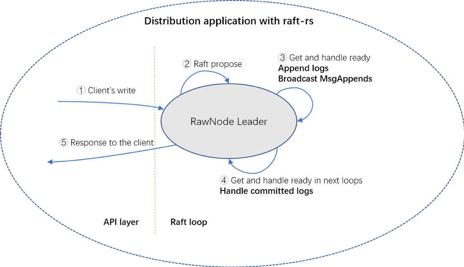

本文为 TiKV 源码解析系列的第二篇，按照计划首先将为大家介绍 TiKV 依赖的周边库 [raft-rs](https://github.com/pingcap/raft-rs) 。raft-rs 是 Raft 算法的 [Rust](https://www.rust-lang.org/) 语言实现。Raft 是分布式领域中应用非常广泛的一种共识算法，相比于此类算法的鼻祖 Paxos，具有更简单、更容易理解和实现的特点。

分布式系统的共识算法会将数据的写入复制到多个副本，从而在网络隔离或节点失败的时候仍然提供可用性。具体到 Raft 算法中，发起一个读写请求称为一次 proposal。本文将以 raft-rs 的公共 API 作为切入点，介绍一般 proposal 过程的实现原理，让用户可以深刻理解并掌握 raft-rs API 的使用， 以便用户开发自己的分布式应用，或者优化、定制 TiKV。

文中引用的代码片段的完整实现可以参见 raft-rs 仓库中的 source-code 分支。

## Public API 简述

仓库中的 `examples/five_mem_node/main.rs` 文件是一个包含了主要 API 用法的简单示例。它创建了一个 5 节点的 Raft 系统，并进行了 100 个 proposal 的请求和提交。经过进一步精简之后，主要的类型封装和运行逻辑如下：

```
struct Node {
    // 持有一个 RawNode 实例
    raft_group: Option<RawNode<MemStorage>>,
    // 接收其他节点发来的 Raft 消息
    my_mailbox: Receiver<Message>,
    // 发送 Raft 消息给其他节点
    mailboxes: HashMap<u64, Sender<Message>>,
}
let mut t = Instant::now();
// 在 Node 实例上运行一个循环，周期性地处理 Raft 消息、tick 和 Ready。
loop {
    thread::sleep(Duration::from_millis(10));
    while let Ok(msg) = node.my_mailbox.try_recv() {
        // 处理收到的 Raft 消息
        node.step(msg); 
    }
    let raft_group = match node.raft_group.as_mut().unwrap();
    if t.elapsed() >= Duration::from_millis(100) {
        raft_group.tick();
        t = Instant::now();
    }
    // 处理 Raft 产生的 Ready，并将处理进度更新回 Raft 中
    let mut ready = raft_group.ready();
    persist(ready.entries());  // 处理刚刚收到的 Raft Log
    send_all(ready.messages);  // 将 Raft 产生的消息发送给其他节点
    handle_committed_entries(ready.committed_entries.take());
    raft_group.advance(ready);
}

```

这段代码中值得注意的地方是：

1. RawNode 是 raft-rs 库与应用交互的主要界面。要在自己的应用中使用 raft-rs，首先就需要持有一个 RawNode 实例，正如 Node 结构体所做的那样。

2. RawNode 的范型参数是一个满足 Storage 约束的类型，可以认为是一个存储了 Raft Log 的存储引擎，示例中使用的是 MemStorage。

3. 在收到 Raft 消息之后，调用 `RawNode::step` 方法来处理这条消息。

4. 每隔一段时间（称为一个 tick），调用 `RawNode::tick` 方法使 Raft 的逻辑时钟前进一步。

5. 使用 `RawNode::ready` 接口从 Raft 中获取收到的最新日志（`Ready::entries`），已经提交的日志（`Ready::committed_entries`），以及需要发送给其他节点的消息等内容。

6. 在确保一个 Ready 中的所有进度被正确处理完成之后，调用 `RawNode::advance` 接口。

接下来的几节将展开详细描述。

## Storage trait

Raft 算法中的日志复制部分抽象了一个可以不断追加写入新日志的持久化数组，这一数组在 raft-rs 中即对应 Storage。使用一个表格可以直观地展示这个 trait 的各个方法分别可以从这个持久化数组中获取哪些信息：

| 方法 | 描述 |
|:--------------|:--------------------------------------------|
| initial_state| 获取这个 Raft 节点的初始化信息，比如 Raft group 中都有哪些成员等。这个方法在应用程序启动时会用到。 |
| entries | 给定一个范围，获取这个范围内持久化之后的 Raft Log。 |
| term | 给定一个日志的下标，查看这个位置的日志的 term。 |
| first_index | 由于数组中陈旧的日志会被清理掉，这个方法会返回数组中未被清理掉的最小的位置。 |
| last_index | 返回数组中最后一条日志的位置。 |
| snapshot | 返回一个 Snapshot，以便发送给日志落后过多的 Follower。 |

值得注意的是，这个 Storage 中并不包括持久化 Raft Log，也不会将 Raft Log 应用到应用程序自己的状态机的接口。这些内容需要应用程序自行处理。

## `RawNode::step` 接口

这个接口处理从该 Raft group 中其他节点收到的消息。比如，当 Follower 收到 Leader 发来的日志时，需要把日志存储起来并回复相应的 ACK；或者当节点收到 term 更高的选举消息时，应该进入选举状态并回复自己的投票。这个接口和它调用的子函数的详细逻辑几乎涵盖了 Raft 协议的全部内容，代码较多，因此这里仅阐述在 Leader 上发生的日志复制过程。

当应用程序希望向 Raft 系统提交一个写入时，需要在 Leader 上调用 `RawNode::propose` 方法，后者就会调用 `RawNode::step`，而参数是一个类型为 `MessageType::MsgPropose` 的消息；应用程序要写入的内容被封装到了这个消息中。对于这一消息类型，后续会调用 `Raft::step_leader` 函数，将这个消息作为一个 Raft Log 暂存起来，同时广播到 Follower 的信箱中。到这一步，propose 的过程就可以返回了，注意，此时这个 Raft Log 并没有持久化，同时广播给 Follower 的 MsgAppend 消息也并未真正发出去。应用程序需要设法将这个写入挂起，等到从 Raft 中获知这个写入已经被集群中的过半成员确认之后，再向这个写入的发起者返回写入成功的响应。那么， 如何能够让 Raft 把消息真正发出去，并接收 Follower 的确认呢？

## `RawNode::ready` 和 `RawNode::advance` 接口

这个接口返回一个 Ready 结构体：

```
pub struct Ready {
    pub committed_entries: Option<Vec<Entry>>,
    pub messages: Vec<Message>,
    // some other fields...
}
impl Ready {
    pub fn entries(&self) -> &[Entry] {
        &self.entries
    }
    // some other methods...
}
```

一些暂时无关的字段和方法已经略去，在 propose 过程中主要用到的方法和字段分别是：

| 方法/字段 | 作用 |
|:-----------------|:------------------------|
| entries（方法） | 取出上一步发到 Raft 中，但尚未持久化的 Raft Log。 |
| committed_entries | 取出已经持久化，并经过集群确认的 Raft Log。 |
| messages | 取出 Raft 产生的消息，以便真正发给其他节点。|

对照 `examples/five_mem_node/main.rs` 中的示例，可以知道应用程序在 propose 一个消息之后，应该调用 `RawNode::ready` 并在返回的 Ready 上继续进行处理：包括持久化 Raft Log，将 Raft 消息发送到网络上等。

而在 Follower 上，也不断运行着示例代码中与 Leader 相同的循环：接收 Raft 消息，从 Ready 中收集回复并发回给 Leader……对于 propose 过程而言，当 Leader 收到了足够的确认这一 Raft Log 的回复，便能够认为这一 Raft Log 已经被确认了，这一逻辑体现在 `Raft::handle_append_response` 之后的 `Raft::maybe_commit` 方法中。在下一次这个 Raft 节点调用 `RawNode::ready` 时，便可以取出这部分被确认的消息，并应用到状态机中了。

在将一个 Ready 结构体中的内容处理完成之后，应用程序即可调用这个方法更新 Raft 中的一些进度，包括 last index、commit index 和 apply index 等。

## `RawNode::tick` 接口

这是本文最后要介绍的一个接口，它的作用是驱动 Raft 内部的逻辑时钟前进，并对超时进行处理。比如对于 Follower 而言，如果它在 tick 的时候发现 Leader 已经失联很久了，便会发起一次选举；而 Leader 为了避免自己被取代，也会在一个更短的超时之后给 Follower 发送心跳。值得注意的是，tick 也是会产生 Raft 消息的，为了使这部分 Raft 消息能够及时发送出去，在应用程序的每一轮循环中一般应该先处理 tick，然后处理 Ready，正如示例程序中所做的那样。

## 总结

最后用一张图展示在 Leader 上是通过哪些 API 进行 propose 的：



本期关于 raft-rs 的源码解析就到此结束了，我们非常鼓励大家在自己的分布式应用中尝试 raft-rs 这个库，同时提出宝贵的意见和建议。后续关于 raft-rs 我们还会深入介绍 Configuration Change 和 Snapshot 的实现与优化等内容，展示更深入的设计原理、更详细的优化细节，方便大家分析定位 raft-rs 和 TiKV 使用中的潜在问题。
